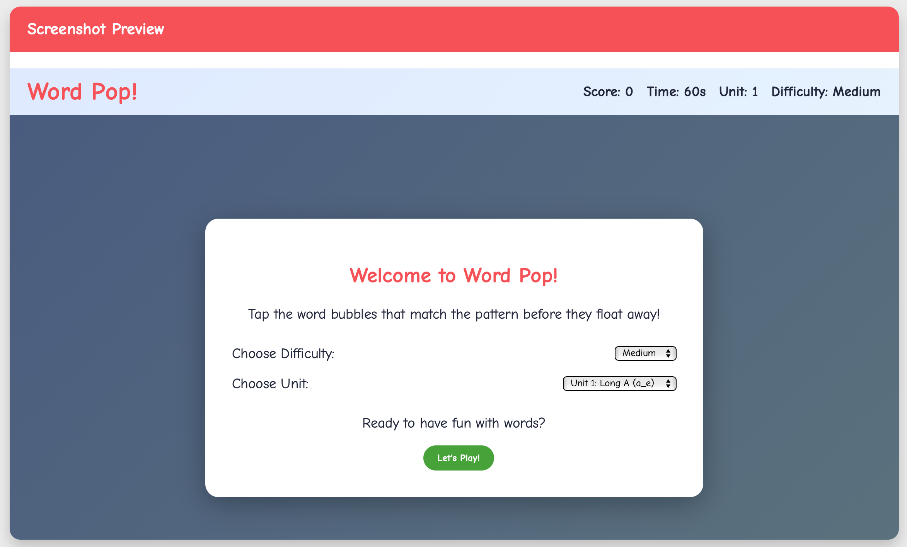
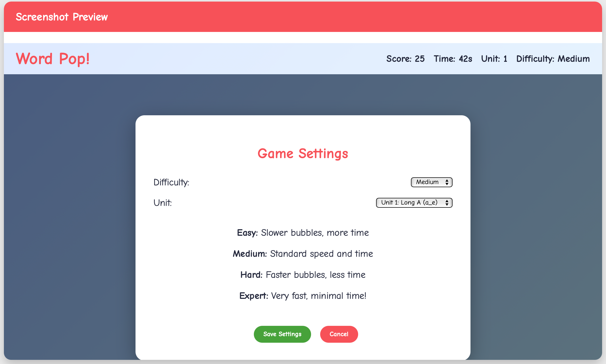
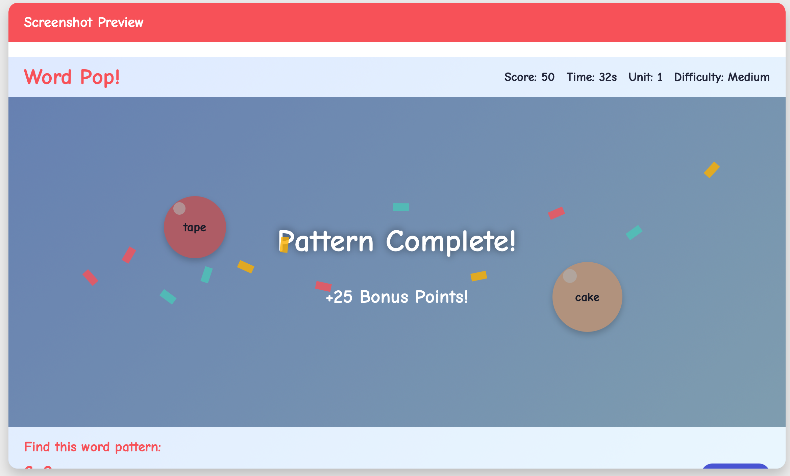

# Word Pop! - Educational Vocabulary Game


Word Pop! is a fun and engaging educational game designed to help elementary school children learn word patterns and vocabulary. Using colorful bubble animations and game mechanics, it makes learning phonics patterns enjoyable and interactive.

## 🎮 Game Overview

- **Learning Objective**: Sight word recognition and phonics pattern reinforcement
- **Target Age Group**: Elementary school children (Grades 1-3)
- **Skills Developed**: Word recognition, reading fluency, phonics patterns, hand-eye coordination
- **Technologies Used**: HTML5, CSS3, JavaScript (Vanilla)

## 🚀 How to Play

1. Words float up from the bottom of the screen like bubbles
2. The player is given a specific word pattern to look for (e.g., "a_e")
3. Tap on the words that match the pattern before they float away
4. Gain points for correct words, lose points for incorrect ones
5. Try to get as many points as possible before the timer runs out

## 🖥️ Installation and Setup

**Option 1: Play Online**
- Visit the [Live Demo](https://mdmohsin109.github.io/word-pop-game) *(Update with your actual GitHub Pages URL once deployed)*

**Option 2: Local Installation**
1. Clone the repository:
   ```bash
   git clone https://github.com/mdmohsin109/word-pop-game.git
   ```
2. Navigate to the project folder:
   ```bash
   cd word-pop-game
   ```
3. Open `index.html` in a web browser to start playing

**Option 3: Development Setup**
1. Clone the repository as above
2. If you want to use a local server (recommended for development):
   ```bash
   npx serve
   # OR
   npx http-server
   ```
3. The game will be available at `http://localhost:3000` or similar

**Requirements**
- Modern web browser with JavaScript enabled
- No additional libraries or frameworks required

## ✨ Features

- **Multiple Difficulty Levels**: Easy, Medium, Hard, and Expert modes to accommodate different learning stages
- **Unit Selection**: Choose from 8 different units focusing on various phonics patterns
- **Adaptive Learning**: Game automatically progresses through patterns as the player improves
- **Interactive UI**: Colorful, kid-friendly interface with engaging bubble animations
- **Performance Tracking**: Score tracking, timer, and words-popped counter
- **Audio Feedback**: Sound effects for correct and incorrect selections
- **Visual Rewards**: Celebration animations upon completing units
- **Responsive Design**: Works on various devices including tablets and desktops
- **Progress System**: Tracks advancement through word patterns

## 📚 Educational Content

The game covers key phonics patterns from Level 3 reading curriculum, including:

- **Long Vowel Patterns**: a_e, i_e, o_e, u_e (silent e patterns)
- **Vowel Teams**: ai/ay, ee/ea, igh/ie/y, oa/ow, ue/ui/ew/oo
- **Word Families**: -ame, -ake, -ate, -ave, -ime, -ike, -ive, -ine, and more

Each unit focuses on specific patterns to build reading fluency and pattern recognition.

## 🛠️ Technologies Used

- **HTML5** - Structure and content
- **CSS3** - Styling and animations
- **JavaScript (ES6+)** - Game logic and interactivity
- **Web Audio API** - Sound effects

## 📝 Development Process

This educational game was developed with a focus on both learning outcomes and engaging gameplay. The development process included:

1. Educational content planning and organization
2. User experience design for children
3. Implementation of game mechanics
4. Difficulty balancing for different age groups
5. Responsive design for accessibility

## 🤝 Contributing

Contributions are welcome! Whether you're fixing bugs, improving the documentation, or proposing new features, your help is appreciated.

1. Check out the [issues page](https://github.com/mdmohsin109/word-pop-game/issues) for open issues
2. See our [CONTRIBUTING.md](CONTRIBUTING.md) for contribution guidelines
3. Review the [CODE_OF_CONDUCT.md](CODE_OF_CONDUCT.md) for community guidelines

## 🔮 Future Enhancements

- User accounts to save progress
- Additional word sets and levels
- Detailed performance analytics for educators
- Multiplayer mode for classroom competition
- Accessibility features for diverse learners

## 📸 Screenshots

<table>
  <tr>
    <td></td>
    <td></td>
  </tr>
  <tr>
    <td></td>
    <td></td>
  </tr>
</table>

## 🙏 Acknowledgments

- [Font Awesome](https://fontawesome.com/) for the icons
- [Comic Neue](https://www.comicneue.com/) font by Craig Rozynski
- The educational professionals who provided feedback during development

## 📄 License

This project is licensed under the MIT License - see the [LICENSE](LICENSE) file for details.

## 👤 Author

Created by [MD MOHSIN](https://github.com/mdmohsin109) - *Educational Game Developer*

---

Enjoy learning with Word Pop!


